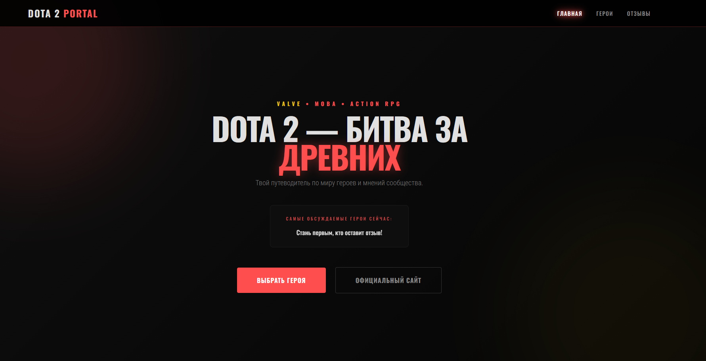

# 🎮 Dota 2 Review Portal

<p align="center">
  
  
  
  
</p>

---

## 📝 Описание проекта
Учебный web-проект по дисциплине **«Межплатформенное программирование»**, демонстрирующий работу с базой данных SQLite, контейнеризацию приложений и взаимодействие Fullstack-частей (Backend + Frontend).




## 📂 Структура проекта

```text
dota2-review/
├── 📁 backend/                # Серверная часть приложения
│   ├── 📁 app/                # Исходный код API и логика БД
│   │   ├── main.py            # Точка входа и инициализация FastAPI
│   │   ├── database.py        # Настройка подключения к SQLite
│   │   ├── models.py          # ORM-модели таблиц
│   │   └──routes.py           # Маршрутизация: обработка путей и запросов (эндпоинтов)
│   ├── requirements.txt
│   └── Dockerfile             # Инструкции сборки образа бэкенда
├── 📁 frontend/               # Клиентская часть (статические файлы)
│   ├── index.html             # Главная страница интерфейса
│   ├── style.css              # Стили оформления
│   ├── script.js              # Логика запросов к API
│   ├── nginx.conf             # Конфигурация веб-сервера Nginx
│   └── Dockerfile             # Инструкции сборки образа фронтенда
└── docker-compose.yml         # Файл оркестрации всех сервисов
```


## 🛠 Используемые технологии

| Стек | Технологии |
| :--- | :--- |
| **Язык** | Python 3.12+ |
| **Backend** | FastAPI, Uvicorn |
| **Database** | SQLite, SQLAlchemy (ORM) |
| **Frontend** | HTML5, CSS3, JavaScript |
| **DevOps** | Docker, Docker Compose, Nginx |

## 💾 Особенности реализации БД
В проекте используется **SQLite**, что позволяет хранить данные в одном файле внутри проекта. 
Для обеспечения сохранности данных и возможности их просмотра в IDE (PyCharm/VS Code), в `docker-compose.yml` настроено монтирование (**Volumes**), которое синхронизирует файл базы данных между контейнером и локальной папкой проекта.

## 🚀 Инструкция по запуску

### Предварительные требования
* Установленный **Docker Desktop**.

### Запуск проекта
1. Откройте терминал в корневой папке проекта (`dota2-review`).
2. Выполните команду для сборки и запуска:
```bash
docker-compose up --build
```

### Ссылки для запуска
* [Backend](http://localhost:8010)
* [Frontend](http://localhost:8080)
* [Swagger UI](http://localhost:8010/docs)

## 🎯 Назначение проекта
### Данная работа демонстрирует ключевые навыки разработки:

* Проектирование БД: Работа с реляционными базами данных через абстракцию ORM.

* Микросервисная логика: Настройка взаимодействия между изолированными контейнерами.

* Оркестрация: Управление инфраструктурой приложения через Docker Compose.

## Автор
### Степанова Виктория
### ВО-ИСиТ-31
### Межплатформенное программирование
### Лабораторная работа №4: Кроссплатформенная работа с базами данных